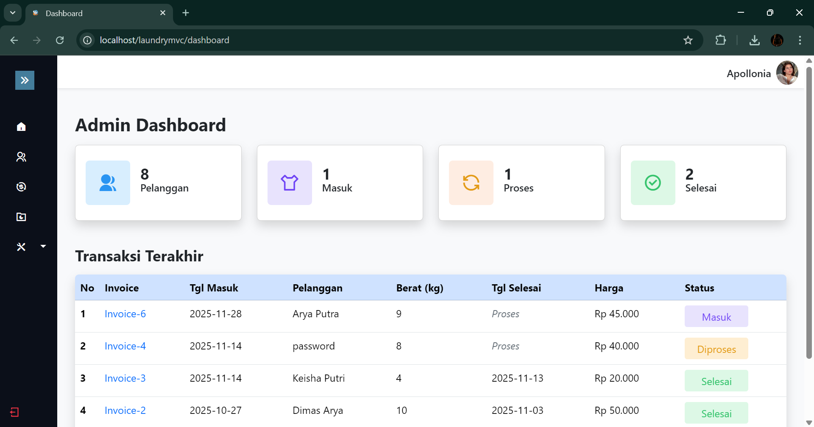
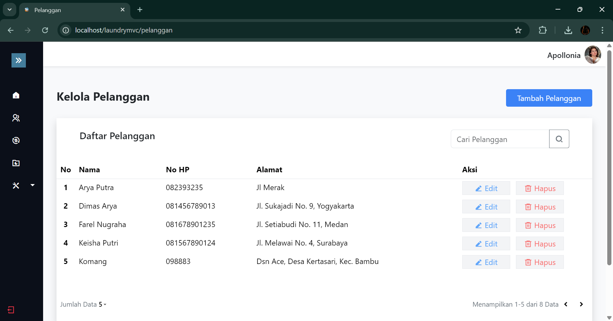
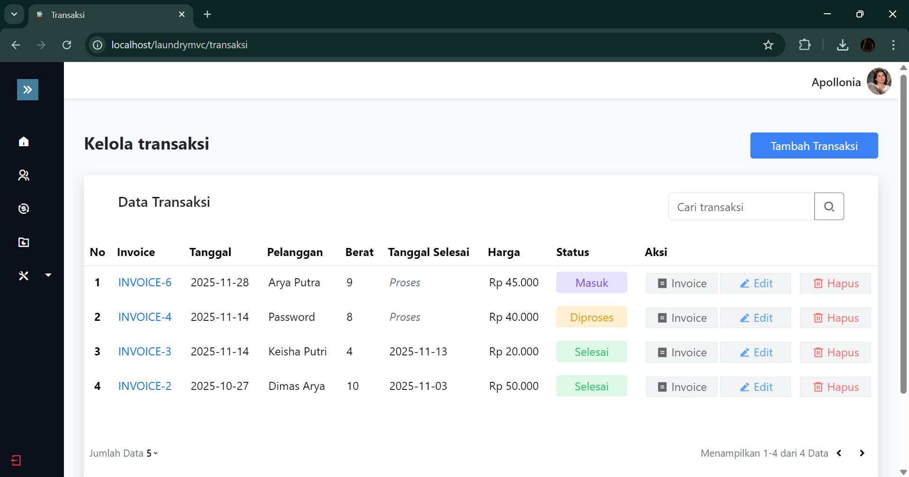
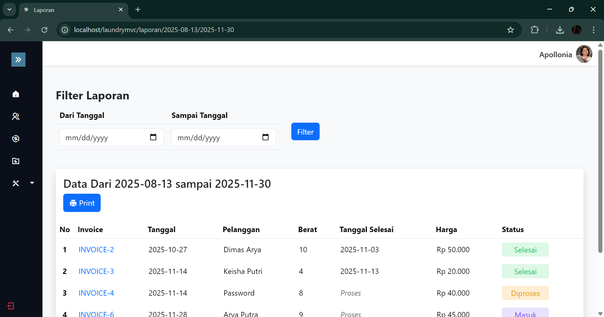
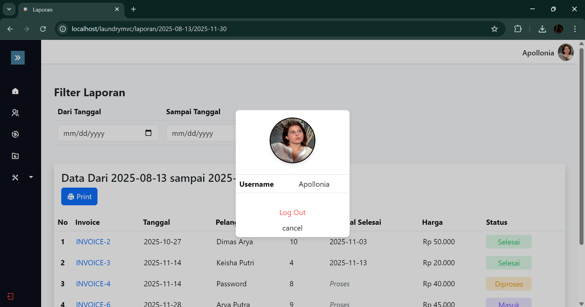

# 🧺 Sistem Laundry

Project ini merupakan praktik mata pelajaran **KKRPL Bu Ana** dengan studi kasus **Sistem Laundry**.  
Dalam pengembangan project ini, saya menggunakan konsep **MVC (Model–View–Controller)** sebagai bentuk latihan mandiri agar lebih memahami tentang pemisahan logika, tampilan, dan pengolahan data pada aplikasi berbasis PHP.

---

### 📂 Struktur Folder Project
```bash
laundrymvc/
│
├── app/                     # Folder utama MVC
│   ├── Controllers/         # Mengatur request & logic aplikasi
│   ├── Models/              # Pengolahan database
│   ├── Views/               # File tampilan (UI)
│   ├── Config/              # Berisi config domain & koneksi database
│   └── Core/                # Routing, Database handler, BaseController, dll
│
├── assets/                  # Bootstrap, jQuery, CSS, JS, Images
│   ├── css/
│   ├── js/
│   └── img/
│
├── .htaccess                # URL rewrite untuk routing MVC
└── index.php                # File utama / landing page aplikasi

```


---

## 🚀 Teknologi yang Digunakan

| Teknologi | Keterangan |
|----------|-------------|
| PHP 8.2 | Backend & logika MVC |
| Bootstrap 5 | Tampilan UI responsif |
| jQuery | Interaksi dinamis & AJAX |

---

## 🔥 Contoh Fitur

- Manajemen pelanggan
- Input transaksi laundry
- Status pengerjaan (Masuk / Proses / Selesai)
- Cetak struk / invoice
- Dashboard laporan

---

## 📌 Catatan

- File `index.php` adalah **entry point** sistem.
- Routing dikendalikan oleh `.htaccess` untuk mendirect URL ke controller.
- Struktur MVC membuat aplikasi lebih terstruktur dan mudah dikembangkan.

---

## 🔍 Preview Tampilan Aplikasi

Berikut beberapa tampilan menu utama pada Sistem Laundry:

### 📊 Dashboard


### 👤 Data Pelanggan


### 🧾 Transaksi Laundry


### 📚 Laporan Laundry


### 🧑 Profile Admin



